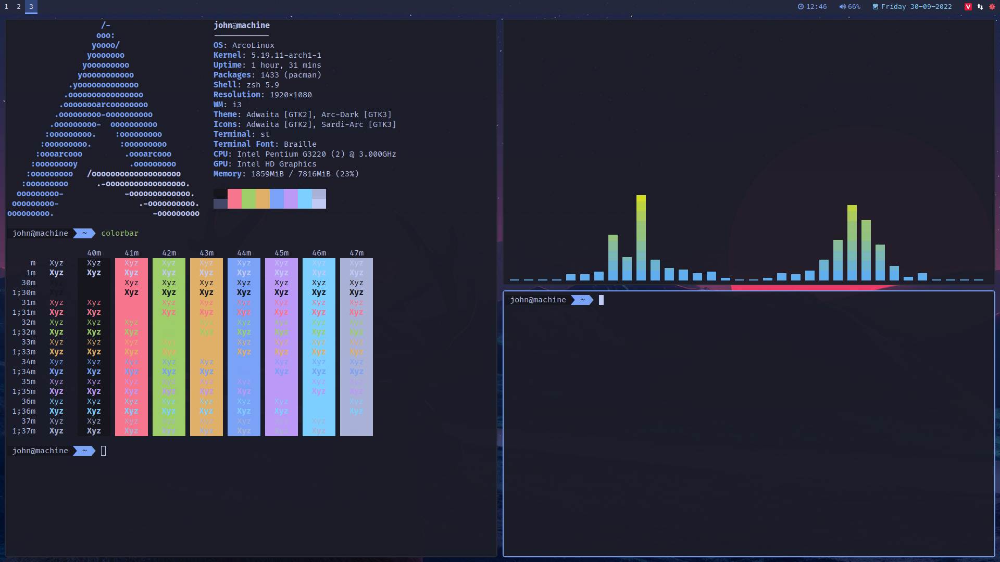

# dotfiles


# What you will need
- Python 3
- [i3-gaps](https://github.com/Airblader/i3)
- [Polybar](https://github.com/jaagr/polybar)
- [Rofi](https://github.com/DaveDavenport/rofi)
- [Font-Awesome-5](https://fontawesome.com)
- [Nitrogen](https://aur.archlinux.org/packages/nitrogen-git)
- [nerd-fonts-complete](https://aur.archlinux.org/packages/nerd-fonts-complete/)
- [Adobe Source Code Pro font](https://github.com/adobe-fonts/source-code-pro)
- [rxvt-unicode](https://wiki.archlinux.org/index.php/Rxvt-unicode)
- [alsa-utils](https://archlinux.org/packages/extra/x86_64/alsa-utils)
- [mate-power-manager](https://archlinux.org/packages/community/x86_64/mate-power-manager)

## Installing
You will need `git` and GNU `stow`

Clone into your `$HOME` directory or `~`

```bash
git clone https://github.com/ZepbachVNTM/dotfiles.git ~
```

Run `stow` to symlink everything or just select what you want

```bash
stow ./ # Everything
```

```bash
stow i3 # Just my i3 config
```

# Attention
<b style="color: red">Attention: backgrounds directory is not configurable</b>

[Neovim](#neovim)

## Neovim
after configuring neovim. Use this command to install the extension

```bash
nvim -u /home/zepbachvntm/.config/nvim/init.lua +PackerInstall

cd ~/.local/share/nvim/site/pack/packer/start/coc.nvim
yarn install --frozen-lockfile --ignore-engines
```


if you can't use system clipboard. Please download this

### Ubuntu
```bash
sudo apt-get install xclip
```


### Arch linux
```bash
pacman -S xclip
```
